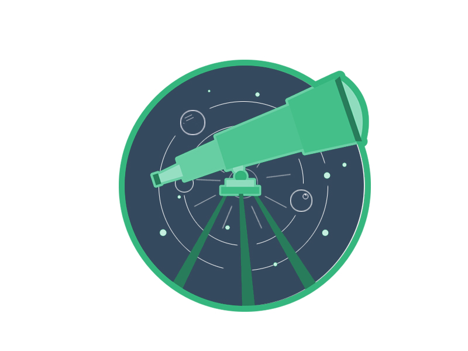

 <h1 align="center">Telescope</h1>
  

      Telescope is a particular Cosmos graphical user interface written in Vue.js.
     
    <a href="docs/"><strong>Explore the docs »</strong></a>
     
     
    <a href="https://github.com/iot-uca/front-end/issues/new?labels=Type%3A+Defect">Report defect</a>
    |
    <a href="https://github.com/iot-uca/front-end/issues/new?labels=Type%3A+Feature">Request feature</a>
  

> *Name origin*: The Telescope was one the first human-invented tools for exploring the Cosmos 

With Telescope, we aim to provide a simple, light-weight, powerfull platform to explore and interact with Cosmos.

> Structural Projects

- [Vue JS 2](https://github.com/vuejs/vue)
- [Vue Router](https://github.com/vuejs/vue-router)
- [Vue X](https://github.com/vuejs/vuex)
- [Bootstrap 4.3](https://getbootstrap.com/docs/4.3/getting-started/introduction/)
- [Chart Js](https://github.com/chartjs/Chart.js)
- [Axios](https://github.com/axios/axios)
- [Moxios](https://github.com/axios/moxios)

> Production Components

- [Docker](https://www.docker.com/)
- [Nginx](https://www.nginx.com/)

## License
- The code is licensed under [MIT](LICENSE).

## How to run

A Docker image is pushed to Docker Hub every time CI runs successfully.

> *Download the latest docker image*:

  docker pull jnahas/cosmos-ui

> *Open CLI and run*:

  docker run -it -p 7080:80 --rm --name telescope jnahas/cosmos-ui

## Contibute

* Clone repository
* Open Telescope project in your favorite IDE/Text-Editor
* Enjoy!
