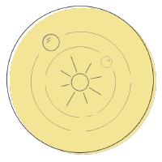

 <h1 align="center">Cosmos</h1>
  

      X is particular Cosmos graphical user interface written in Vue.js.
     
    <a href="docs/"><strong>Explore the docs »</strong></a>
     
     
    <a href="https://github.com/iot-uca/front-end/issues/new?labels=Type%3A+Defect">Report defect</a>
    |
    <a href="https://github.com/iot-uca/front-end/issues/new?labels=Type%3A+Feature">Request feature</a>
  

> *Name origin*: TBD

With X, we aim to provide a simple, light-weight, powerfull platform to interact with Cosmos.

> Structural Projects

- [Vue JS 2](https://github.com/vuejs/vue)
- [Vue Router](https://github.com/vuejs/vue-router)
- [Vue X](https://github.com/vuejs/vuex)
- [Bootstrap 4.1](https://getbootstrap.com/docs/4.1/getting-started/introduction/)
- [Chart Js](https://github.com/chartjs/Chart.js)

> Production Components

- [Docker](https://www.docker.com/)
- [Nginx](https://www.nginx.com/)

## License
- The code is licensed under [MIT](LICENSE).

## Get started!

* Clone repository
* Open project on your favorite IDE/Text-Editor
* Enjoy!
